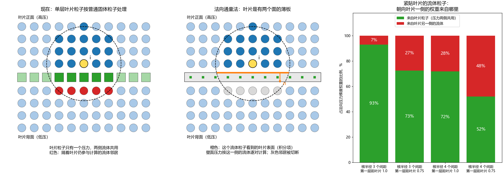

# 薄壁两侧流体的处理：文献研究和方案建议（2026-09-30）

文献全文在 `SPH lifeline/reference/`（不入库）。本文只写结论、公式和出处，公式旁边注明论文里的式号。
标注"我们的核算"的内容是本机用 numpy 算的，脚本在会话的临时目录里，不入库。

> **补记（2026-09-30 晚）：第 5 到 8 节的表面积分形式已经实现并测试，没有采用。**
> 它能托住静压差，但在 1 kPa 的绝对压力下板的自由边不稳定：把隔着板的邻居切断之后，
> 核支撑在"过板边缘的射线面"上中断，那里没有壁面项可以补。对称形式的误差与绝对压力成正比，
> 差值形式线性不稳定。记录见 `log/2026-09-30_thin-plates-normal-flux.md`（提交 441deb4）。
> 最后采用的是体积形式：板背后的邻居全部当作壁面的虚粒子，核支撑保持完整。
> 公式、测试和已知问题见 `log/2026-09-30_thin-plates-mirror.md`。
> 第 2 到 4 节的文献整理和核算仍然有效。

## 1 要解决的问题

叶片、圆盘和挡板都是薄板，两侧都有流体。现在每块薄板用一层粒子表示，按普通固体粒子处理。这样做有三个缺陷：

| 缺陷 | 说明 |
| --- | --- |
| 压力两侧共用 | 一个叶片粒子只有一个压力值，正面和背面的流体用的是同一个值 |
| 隔着叶片直接作用 | 核半径 3 个间距，叶片只有 1 个间距厚，两侧的流体粒子互为邻居 |
| 厚度偏大 | 3 mm 分辨率下单层粒子的等效厚度是 3.5–4.2 mm，真实叶片是 2.2–2.5 mm |

涉及的薄板一共 16 块，全部是平板：

| 部件 | 数量 | 真实厚度 | 归属 |
| --- | --- | --- | --- |
| Rushton 叶片 | 6 | 2.2 mm | 转子 |
| Rushton 圆盘 | 1 | 2.5 mm | 转子 |
| PBT 叶片 | 6 | 2.5 mm | 转子 |
| 挡板 | 3 | 2.6 mm | 静止壁面 |

轮毂、轴、钟形罩、槽壁和槽底只有一侧有流体，不属于这个问题，保持现在的做法。

## 2 文献里的做法

### 2.1 总表

| 文献 | 维数 | 流动 | 薄壁的表示 | 壁面压力 | 两侧 | 验证算例 |
| --- | --- | --- | --- | --- | --- | --- |
| Gao 和 Fu 2024 | 三维 | 粘性，Re 200–1600 | 单层粒子加边界积分 | 逐对：p_i + ρ c₀ 乘以法向相对速度 | 分侧并切断 | 飘动的旗，来流中的弯曲板，L 形板 |
| Bao 等 2024 | 二维 | 粘性加 k-ε，Re 200 | 单层粒子加边界积分 | 每一侧各自从流体外推（Adami） | 分侧并切断 | 细丝飘动，静水柱压板 |
| Peng 等 2021 | 二维 | 无粘，自由面冲击 | 单层粒子加边界积分 | 每一侧各自插值，含伯努利修正和静水项 | 分侧并切断 | 静水柱压板，溃坝冲击弹性闸门和挡板 |
| Chiron 等 2019 | 二维和三维 | 粘性和无粘 | 三角形面片加边界积分，解析 γ | 逐对：p_i + ρ c 乘以法向相对速度 | 只有单侧 | Poiseuille，圆柱和方柱绕流，三维静水，三维溃坝 |
| Ferrand 2013、Leroy 2014、Mayrhofer 2015 | 二维、二维、三维 | 层流和 k-ε | 线段或三角形加解析 γ | 从流体插值，含静水项 | 只有单侧 | 槽道流，静水，溃坝，鱼道 |
| Macià 等 2012 | 一维和二维 | 相容性分析 | 边界积分加归一化 | — | 只有单侧 | 导数算子测试，管流，晃荡 |
| Kulasegaram 等 2004 | 二维 | 变分推导 | 接触力 ∝ ∇γ/γ | — | 只有单侧 | 溃坝等 |
| Wang 等 2023 | 三维 | δ⁺-SPH，Re 20–200 | 单层粒子，移动最小二乘直接强迫 | 不用压力，直接改速度 | 不分侧，不切断 | 突然起动的平板，圆柱绕流 |
| Wu 等 2026 | 二维和三维 | Riemann SPH | 单层壳粒子沿法向投影出虚拟粒子 | 逐对外推 | **只做了单侧** | 静水，溃坝，圆柱绕流，接触 |

结论：在读到的文献里，**"单层粒子、两侧都有流体"的算例都用边界积分（法向通量）加分侧切断**，三维的只有 Gao 和 Fu 2024 一篇。
Wu 等 2026 的引言也是这样归类的，并说明自己的方法还不能处理两侧都有流体的情况。

### 2.2 Gao 和 Fu 2024（最接近我们要做的）

- 梯度的边界积分形式（式 24）：体积项加上面积项，面积项只用到壁面上的值。归一化因子 γ 取 1，理由是效率和简单。
- 流体方程（式 26）：连续方程、压力项、粘性项各有一个对壁面粒子求和的面积项。
- 分侧（式 31）：流体粒子找最近的壳粒子，按法向的正负标记 +1 或 −1，超出壳边缘的标记 0。
- 切断（式 32）：标记相反的流体粒子互相不作用。
- 壁面压力（式 34）：p_ik = p_i + ρ₀ c₀ (v_i − v_k)·n，逐对计算，不需要给壳粒子存压力。
- 位移修正带面积项（式 38）。
- **无滑移做不准**（4.3 节）：边界积分的粘性项会让流体在壁面上打滑。他们加了一个速度惩罚项，松弛因子 0.02。
  不加时旗的飘动周期误差超过 10%，加密也不收敛。
- **壁面附近有压力振荡**（4.2.1 节末）：单层边界没有多层粒子的平滑作用。他们靠每 20 步一次的 Shepard 过滤和密度耗散来压制。
- 核半径 2.8 个间距，c₀ 取 10–25 倍来流速度。

### 2.3 Bao 等 2024 和 Peng 等 2021

- 两篇都是二维。壁面压力按侧分别计算，结构粒子对每一侧各有一个值（Bao 式 29–31，Peng 式 41–42）。
- Bao 在结构的端部做了特殊处理（表 1）：端部附近的流体粒子把结构粒子当普通粒子，用两侧的平均值，不加面积项。
- Bao 报告结构两端的压力与周围明显不同（3.1 节），他们归因于密度扩散项。**端部和边缘是这类方法的薄弱处。**
- Peng 的位移修正也加了面积项（式 45–46）。
- 两篇都验证了静水柱压在弹性板上的算例，说明这类方法能承受静水压。

### 2.4 Chiron 等 2019

- 壁面用面片，面片上布求积点。三维里每个核半径 3 个求积点就够（8.1 节）；粒子离壁面超过 0.3 个核半径时 2 个就够。
- 粘性的壁面项（式 92）：用速度差除以到壁面的法向距离。Poiseuille 流的收敛阶约 1.9。
- 三维静水算例算到 20 s 没有粒子穿出。
- 明确写了这套做法推广到 δ-SPH 没有理论障碍（第 7 节末）。

### 2.5 Ferrand 2013、Mayrhofer 2015 的两个警告

- **长时间计算时粒子会慢慢穿过壁面**（Ferrand 3.3–3.4 节）。原因是连续方程的时间积分误差：
  粒子在壁面附近来回振荡，密度系统性地偏低，压力不足以把粒子推回去。
  c₀ = 20 m/s 时粒子穿出；c₀ = 100 m/s（时间步更小）时不再穿出，但水深仍然下降。
  他们的解决办法是让密度只依赖粒子位置（式 42）。
- **面积项算得不准会漏**（Mayrhofer 4.2 节）：用一点求积近似时，角落处有粒子穿出；换成解析积分后不再穿出。
  这与他们把 γ 对时间积分的做法有关，我们不积分 γ，但角落仍要小心。

### 2.6 不建议的两条路

| 方法 | 不建议的原因 |
| --- | --- |
| Wang 等 2023，移动最小二乘浸入边界 | 壁面两侧各有半个核半径厚的"被强迫层"，合计约 3 个间距，相当于把叶片加厚到 9 mm。只在 Re ≤ 200 验证过。两侧流体的压力耦合没有切断 |
| Wu 等 2026，虚拟粒子投影 | 论文只做了单侧。推广到两侧后等价于面积项的一种数值积分，没有额外好处，也没有文献验证 |

## 3 我们的核算

设置：Wendland C4 核，核半径 3 个间距，粒子间距 dx，薄板上的粒子间距也是 dx。

### 3.1 叶片粒子当求积点够不够

面积分 ∫W dS 用薄板上间距 dx 的粒子求和，与精确积分比较：

| 流体粒子到壁面的距离 | 正对一个壁面粒子 | 正对四个壁面粒子的中心 |
| --- | --- | --- |
| 0.1 dx | +0.29% | −0.24% |
| 0.5 dx | +0.16% | −0.15% |
| 1.0 dx | +0.09% | −0.09% |
| 2.0 dx | −0.37% | +0.32% |

误差不超过 0.4%。2.5 dx 处相对误差 4%，但那里的积分值只有 0.5 dx 处的万分之二，可以忽略。
**现有的贴体叶片粒子可以直接当求积点**，不需要 Chiron 那样的面片细分。

### 3.2 隔着叶片的耦合有多大

完整晶格，叶片粒子在 z = 0。看紧贴叶片的第一层流体粒子，朝向叶片一侧的法向压力梯度权重来自哪里：

| 核半径 | 第一层到叶片中面的距离 | 来自叶片粒子 | 来自另一侧的流体 |
| --- | --- | --- | --- |
| 3 dx | 1.0 dx | 93% | 7% |
| 3 dx | 0.75 dx | 73% | 27% |
| 4 dx | 1.0 dx | 72% | 28% |
| 4 dx | 0.75 dx | 52% | 48% |

- 核半径 3 个间距时，**主要的缺陷是叶片粒子的压力两侧共用**，隔着叶片的直接作用只占 7%–27%。
- 核半径 4 个间距时，隔着叶片的直接作用升到 28%–48%。这与实测一致：核半径从 3 增大到 4，力矩下降 31%。

### 3.3 共用的压力撑不住压差

设叶片正面流体压力 P_f，背面 P_b，叶片粒子压力 P_w，第一层流体距叶片 1 dx，核半径 3 dx。
正面第一层粒子在法向上受力为零的条件是

    0.4646 P_f = 0.4326 P_w + 0.0320 P_b

背面第一层粒子的条件是

    0.4646 P_b = 0.4326 P_w + 0.0320 P_f

两式相减得 0.4966 (P_f − P_b) = 0，只有 P_f = P_b 一个解。

也就是说，**只要叶片粒子的压力两侧共用，静止的压差在这套离散方程里没有平衡解**。
压差只能靠两侧粒子间距不对称来维持：高压一侧的流体被挤向叶片。压差大时就会漏。

叶片粒子的压力改成分侧之后，两个条件各自含自己一侧的壁面压力，任意压差都有平衡解。

### 3.4 带壁面项的修正矩阵

Gao 和 Fu 取 γ = 1，壁面附近的梯度会被低估：第一层粒子处 γ ≈ 0.76。
我们的代码本来就有 KCG 修正矩阵，把面积项加进矩阵即可：

    M_i = Σ_j V_j ∇W_ij ⊗ (x_j − x_i) + Σ_k S_k W_is n_ik ⊗ (x_s − x_i)

核算结果（壁面在 z = 0，线性场 f = z）：

| 流体层 | 不含壁面项的 M_zz | 含壁面项的 M_zz | 修正后的梯度 |
| --- | --- | --- | --- |
| 第一层，距壁面 0.5 dx | 0.497 | 0.720 | (0, 0, 1)，精确 |
| 第二层，1.5 dx | 0.929 | 1.009 | (0, 0, 1)，精确 |
| 第三层，2.5 dx | 0.993 | 0.993 | (0, 0, 1)，精确 |

矩阵的条件数良好，线性场的梯度精确。

### 3.5 厚度本身对 Rushton 力矩的影响

我们自己的算例（旧挡板，20–30 s 平均）：

| 叶片 | 等效厚度 | Rushton 力矩，mN·m |
| --- | --- | --- |
| 单层 | 3.5–4.2 mm | 38.0 |
| 两层（h/dx = 2.5） | 约 6 mm | 32.2 |
| 三层 | 约 9 mm | 24.4 |
| Fluent，真实厚度 2.2 mm | — | 60.3 |

厚度越大力矩越低。实验文献有同样的结论：Rutherford 等 1996 测得 Rushton 桨的功率数随叶片和圆盘厚度增大而下降，降幅最多 33%。
这一篇我只看到了检索摘要，没有读全文。

按上表线性外推到 2.2 mm，Rushton 力矩约 42 mN·m。这只是粗略估计，两层的算例核半径不同。
也就是说，厚度只能解释与 Fluent 差距的一小部分，其余要靠消除共用压力和隔板作用来检验。

## 4 方案比较

| 方案 | 解决共用压力 | 解决隔板作用 | 厚度准确 | 文献验证（两侧） | 改动量 |
| --- | --- | --- | --- | --- | --- |
| A 法向通量法 | 是 | 是 | 是，面的位置可以放在 ±t/2 | 三维一篇，二维两篇 | 大 |
| A′ 只分侧和切断，叶片粒子仍按体积粒子 | 是 | 是 | 否 | 无 | 中 |
| B 虚拟粒子投影 | 是 | 是 | 否 | 无 | 中 |
| C 浸入边界 | 不涉及压力 | 否 | 否，更厚 | Re ≤ 200 | 中 |
| D 多层粒子，整体加密到 1 mm | 是 | 是 | 是 | 常规做法 | 无，但粒子数是现在的 27 倍 |

**建议方案 A。** A′ 与 A 共用全部基础设施（薄板定义、分侧、切断、逐对的壁面压力），只差核函数的形式，
实现时用一个开关同时保留，便于对比。

## 5 建议方案的公式

记号：流体粒子 i，流体邻居 j，薄板上的求积点 k（现在的叶片粒子）。薄板的单位法向 n_k，厚度 t，每个求积点代表的面积 S_k。

    s_ik = sign( n_k · (x_i − x_k) )            i 在薄板的哪一侧
    x_s  = x_k + s_ik (t/2) n_k                  i 看到的那个面上的点
    n_ik = − s_ik n_k                            从流体指向薄板内部的法向
    W_is = W(|x_i − x_s|)

### 5.1 薄板用解析的平板描述，粒子只当求积点

每块薄板存：中心、法向、两个面内方向、两个半宽（矩形）或内外半径（圆环）、厚度、每点面积、属于转子还是静止。
生成器里已经有 `blade_frames()`，给出 12 块叶片的这些量；圆盘和挡板补上即可。
转子上的薄板在参考构型里定义，着色器用转角把流体粒子的位置转回参考构型再判断。

与 Gao 和 Fu 的区别：他们按"最近的壳粒子"给流体粒子打标记。我们的叶轮有叶片与圆盘的交接，一个标记不够用，所以改用解析平板。

### 5.2 遮挡判断

对粒子对 (i, j) 和 i 附近的每块薄板 p（中心 c_p，法向 n_p）：

    d_i = n_p · (x_i − c_p),   d_j = n_p · (x_j − c_p)
    若 d_i d_j < 0：交点 x_c = x_i + d_i / (d_i − d_j) (x_j − x_i)
    若 x_c 落在薄板的轮廓内：这一对被遮挡，跳过

j 可以是流体粒子、普通固体粒子，或者另一块薄板上的求积点。每个粒子附近通常只有 1–2 块薄板，代价很小。

### 5.3 连续方程（`density.comp`）

    dρ_i/dt = ρ_i [ Σ_j V_j (v_i − v_j) · B_i ∇W_ij  +  Σ_k S_k (v_i − v_k) · B_i n_ik W_is ]  +  密度扩散项

- 面积项出自 Gao 和 Fu 式 26、Bao 式 26、Peng 式 31。
- B_i 是 5.5 节的修正矩阵的逆。
- 密度扩散项只对流体邻居求和（Gao 和 Fu 的做法）。薄板的求积点不进入扩散项，壁面 ρ₀ 造成的压力汇在薄板附近随之消失。

### 5.4 动量方程的压力项（`force.comp`）

    正压（对称形式）：a_i = −(1/ρ_i) [ Σ_j V_j (P_i + P_j) ∇W̃_ij  +  Σ_k S_k (P_i + P_ik) B_i n_ik W_is ]
    负压（TIC 形式） ：把 (P_i + P_j) 换成 (P_j − P_i)，把 (P_i + P_ik) 换成 (P_ik − P_i)

    壁面压力：P_ik = P_i + ρ_i (g − a_k) · (x_s − x_i) + ρ_i c₀ (v_i − v_k) · n_ik

| 项 | 作用 | 出处 |
| --- | --- | --- |
| P_i | 把流体自己的压力延拓到壁面 | 各篇共有 |
| ρ (g − a_k)·(x_s − x_i) | 静水压和转子向心加速度的修正 | Bao 式 30，Peng 式 33，Wu 式 24 |
| ρ c₀ (v_i − v_k)·n_ik | 流体朝壁面运动时压力升高，起阻尼作用，防止穿透 | Gao 和 Fu 式 34，Chiron 式 37 |

壁面压力逐对计算，薄板粒子不需要存压力，"两侧共用"的问题不再存在。
流体与流体的粒子对用 `reverse` 或 `mean` 修正（`log/2026-09-30_pair-correction-reverse.md`）。

### 5.5 修正矩阵（`correction.comp`）

    M_i = Σ_j V_j ∇W_ij ⊗ (x_j − x_i) + Σ_k S_k W_is n_ik ⊗ (x_s − x_i),      B_i = M_i⁻¹

求和只包括没有被遮挡的邻居。面积项在薄板边缘附近不对称，现在的存储只有对称矩阵的 6 个分量。
实现时要么存完整的 9 个分量，要么只取对称部分；后者在边缘处有小的误差。

### 5.6 粘性的壁面项

第一版用 Chiron 式 92 的形式：

    a_i = − 2 ν Σ_k S_k (v_i − v_k) / d_ik · W_is,      d_ik = |n_k · (x_i − x_s)|，设下限 0.25 dx

保留一个开关可以关掉（自由滑移）。Re = 30,700 时叶片上的边界层远小于粒子间距，力矩主要来自压差，
壁面摩擦的影响预计很小，用开关对比确认。Gao 和 Fu 的速度惩罚项留作备选。

### 5.7 位移修正

    ∇C_i = Σ_j [1 + R (W_ij / W(dx))ⁿ] ∇W_ij V_j + Σ_k [1 + R (W_is / W(dx))ⁿ] n_ik W_is S_k

出自 Gao 和 Fu 式 38、Bao 式 38、Peng 式 46。有了面积项，薄板附近的粒子不会被位移修正推向薄板。

### 5.8 薄板受力

    F_k = Σ_i (m_i / ρ_i) S_k (P_i + P_ik) B_i n_ik W_is + 粘性项的反作用

与流体得到的力严格大小相等、方向相反，沿用现在的反作用力读法。

### 5.9 薄板边缘

不做特殊处理。超出轮廓的流体粒子按同样的规则看到自己一侧的面，只是角度很斜。
薄板的侧边（宽 2.2–2.6 mm 的窄条）忽略不计。

## 6 对现有代码的改动点

| 文件 | 改动 |
| --- | --- |
| `utils/geometry/_demo_stirred_tank_30l.py` | 输出薄板列表；薄板粒子的 `extension_fields.w` 写入薄板编号；圆盘也改成贴体的单层粒子 |
| `utils/sph/case.py` | `case.yaml` 新增 `thin_plates:` 块；新的配置项和 spec 常量 |
| `experiment/v1/utils/simulator_v1.py` | 新增一个小的薄板缓冲区（最多 32 块） |
| `experiment/v1/shaders/common.glsl`、`helpers.glsl` | 薄板结构体、遮挡判断函数、壁面压力函数 |
| `experiment/v1/shaders/correction.comp` | 矩阵加面积项，跳过被遮挡的邻居 |
| `experiment/v1/shaders/density.comp` | 连续方程加面积项，扩散项跳过薄板 |
| `experiment/v1/shaders/force.comp` | 压力、粘性、位移修正加面积项；薄板粒子的反作用力 |

全部放在开关后面，默认关闭，关闭时与现在的代码完全一致。`extension_fields.w` 目前没有被使用。

## 7 验证算例

先在本机做小算例，全部通过后再上搅拌槽。

| 编号 | 算例 | 检查什么 | 通过标准 |
| --- | --- | --- | --- |
| T1 | 封闭盒子被一块竖直薄板隔成两个腔，两腔初始压力相差 500 Pa，有重力 | 压差能否维持，薄板受力，有无穿透 | 2 s 内压差保持在 5% 以内；薄板受力等于压差乘面积，误差 5% 以内；没有粒子穿过 |
| T2 | 同一个盒子，薄板不到顶，均匀背景压力 1000 Pa，无重力 | 边缘处的零阶误差 | 1 s 后最大速度小于 0.01 m/s |
| T3 | 周期管道里的方形薄板，垂直于来流 | 阻力系数，板两侧的压力分布 | 与文献值相差 10% 以内；同时跑现在的单层和三层粒子作对照 |
| T4 | 二维 Couette（没有薄板） | 回归 | 结果与现在一致 |
| T5 | 搅拌槽 6 s 收支算例，然后 30 s | 力矩，流场，叶片穿透统计，角动量收支 | 与 Fluent 比较 |

T1 用现在的单层叶片预计通不过（3.3 节），它是区分新旧做法最直接的算例。

## 8 风险

| 风险 | 依据 | 对策 |
| --- | --- | --- |
| 长时间计算后粒子慢慢漏过薄板 | Ferrand 3.3 节 | 用现有的叶片穿透统计监控；必要时让薄板附近的密度只依赖位置 |
| 薄板附近的压力振荡 | Gao 和 Fu 4.2.1 节 | 我们有密度扩散项，没有 Shepard 过滤；出现振荡时再考虑 |
| 负压区壁面项变成吸引力 | 面积项与压力同号 | 负压区用 TIC 形式，壁面项只剩静水修正和阻尼；1 倍重力下负压粒子只占 0.3% |
| 薄板交接处和边缘的误差 | Bao 3.1 节 | T2 专门检查；交接处用解析平板判断遮挡 |
| 壁面打滑 | Gao 和 Fu 4.3 节 | 用开关对比有无粘性壁面项；备选速度惩罚项 |
| 没有 Re > 1600 或叶轮的公开验证 | 第 2 节 | 以 T1–T3 和与 Fluent 的对比为准 |
| 改动涉及四个着色器 | — | 全部放在开关后面，T4 做回归 |

## 9 需要决定的事

1. 是否按方案 A 做。
2. 挡板和 Rushton 圆盘是否也按薄板处理。建议都按薄板处理。
3. 是否下载 Li 等 2022（JCP 464:111328，https://doi.org/10.1016/j.jcp.2022.111328）。
   它专门讲单层壁面粒子的粘性力，Bao 的粘性项出自这一篇。不是必需，做粘性壁面项时有用。

## 10 需要合作者确认

1. 薄板用解析平板描述、粒子只当求积点的做法，是否符合他对代码结构的设想。
2. 修正矩阵是否可以改成存完整的 9 个分量。
3. `extension_fields.w` 是否有别的计划用途。

## 11 文献

| 文献 | 链接 |
| --- | --- |
| Gao, Fu 2024, CMAME 429:117179 | https://doi.org/10.1016/j.cma.2024.117179 |
| Bao 等 2024, CMAME 431:117255 | https://doi.org/10.1016/j.cma.2024.117255 |
| Peng, Zhang, Wang 2021, JFS 102:103254 | https://doi.org/10.1016/j.jfluidstructs.2021.103254 |
| Chiron 等 2019, CPC 234:93 | https://doi.org/10.1016/j.cpc.2018.08.001 |
| Ferrand 等 2013, IJNMF 71:446 | https://doi.org/10.1002/fld.3666 |
| Leroy 等 2014, JCP 261:106 | https://doi.org/10.1016/j.jcp.2013.12.035 |
| Mayrhofer 等 2015, Numer. Algorithms 68:15 | https://doi.org/10.1007/s11075-014-9835-y |
| Macià 等 2012, PTP 128:439 | https://doi.org/10.1143/ptp.128.439 |
| Kulasegaram 等 2004, Comput. Mech. 33:316 | https://doi.org/10.1007/s00466-003-0534-0 |
| Wang 等 2023, arXiv 2309.10373 | https://arxiv.org/abs/2309.10373 |
| Wu 等 2026, arXiv 2602.19429 | https://arxiv.org/abs/2602.19429 |
| Rutherford 等 1996, Chem. Eng. Res. Des. 74:369（只看了检索摘要） | https://www.semanticscholar.org/paper/765cd4834f001ea196286e138f79631aa9ffd6d4 |
